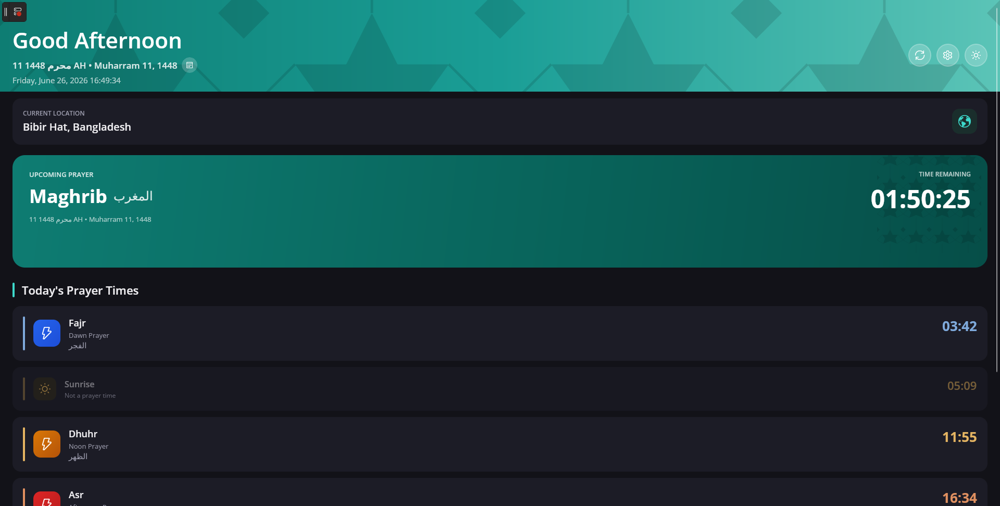

# Noor

<p align="center">
  
</p>

[](https://github.com/azimmahmud/Noor/actions/workflows/build.yml)
[](https://github.com/azimmahmud/Noor/actions/workflows/build.yml)
[](LICENSE)
[](https://dotnet.microsoft.com/download/dotnet/10.0)
[](https://platform.uno)

**Noor** (نور, "light") is a cross-platform Islamic prayer-time companion built with **Uno Platform** and **.NET 10**. It shows accurate daily prayer times, a live countdown to the next prayer, a Hijri calendar with Islamic events, a date converter, and an optional full-screen focus overlay during prayer.

<table align="center">
  <tr>
    <td align="center"></td>
  </tr>
  <tr><td align="center"><sub>Dashboard — live countdown to the next prayer</sub></td></tr>
</table>

---

## Download & Install

Prebuilt binaries for every release are on the [Releases page](https://github.com/AzimMahmud/Noor/releases).

| Platform | File | How to install |
|----------|------|----------------|
| **Windows** | `NoorSetup-<ver>-win-x64.exe` | Run the installer (Inno Setup). Self-contained — no .NET needed. |
| **Linux** (any distro) | `Noor-<ver>-linux-x64.AppImage` | `chmod +x` and double-click / run. No install, no root. |
| **Linux** (Debian/Ubuntu) | `noor_<ver>-1_amd64.deb` | `sudo dpkg -i noor_*.deb` (or your app store). |

> Builds are self-contained. See [Building from source](#build--run) or the
> [packaging docs](packaging) for producing installers yourself.

---

## Features

### Prayer Times
- **Astronomical calculation engine** (built-in) supporting **15 calculation methods** (Muslim World League, ISNA, Egyptian, Makkah, Karachi, Tehran, Jafari, Gulf, Kuwait, Qatar, Singapore, Turkey, Moonsighting Committee, Dubai, and a Custom fallback).
- **Madhab selection** — Hanafi or Shafi (affects Asr).
- **Live countdown** to the next prayer, refreshed every second.
- **Bilingual prayer names** — English + Arabic.
- **12-hour / 24-hour** display toggle.
- The five daily prayers (Fajr, Dhuhr, Asr, Maghrib, Isha) plus sunrise.

### Hijri Calendar
- Full month grid with forward/backward navigation.
- **Islamic events** — Islamic New Year, Ashura, Mawlid al-Nabi, Isra & Mi'raj, Shab-e-Barat, start of Ramadan, Eid al-Fitr, Day of Arafah, Eid al-Adha.
- **Gregorian ↔ Hijri date converter** (powered by the Umm al-Qura calendar).
- Personal reminders with category, repeat, and notification options.

### Focus & Notifications
- Optional **full-screen overlay** during prayer with a configurable countdown.
- Configurable **block duration** (1–120 minutes).
- Azan audio playback (see [Audio](#audio) for platform notes).

### Settings & Theming
- **Location** — auto-detect via HTTPS IP geolocation, or manual latitude/longitude with timezone.
- **Light / Dark theme** with system-follow on first launch.
- Day-cycle-inspired prayer colors, Islamic geometric patterns, and smooth animations.

---

## Getting Started

### Prerequisites

- [.NET 10 SDK](https://dotnet.microsoft.com/download/dotnet/10.0) (the repo pins the SDK via `global.json`)
- **Windows**: Visual Studio 2022 v17.14+ or Rider, with the WinUI / .NET desktop workload.
- **Linux**: `dotnet` CLI or Rider; requires Skia rendering libraries (the Uno desktop host handles this).
- `git` (latest)

### Build & Run

```bash
# Restore packages
dotnet restore

# Build (desktop target: Windows + Linux)
dotnet build -c Release

# Run
dotnet run --project Noor
```

### Publish

```bash
# Windows (self-contained)
dotnet publish Noor -c Release -f net10.0-windows10.0.19041.0 -r win-x64 --self-contained -o ./publish/windows

# Linux (self-contained)
dotnet publish Noor -c Release -f net10.0-desktop -r linux-x64 --self-contained -o ./publish/linux
```

---

## Supported Platforms

| Platform | Status | Notes |
|----------|--------|-------|
| **Windows x64** | ✅ Primary | `net10.0-windows10.0.19041.0` |
| **Linux x64** | ✅ Supported | `net10.0-desktop` (Skia) |
| **Android** | 🧪 Scaffolded | uncomment `net10.0-android` in `Noor.csproj` |
| **iOS** | 🧪 Scaffolded | uncomment `net10.0-ios` (requires macOS) |
| **macOS (Catalyst)** | 🧪 Scaffolded | uncomment `net10.0-maccatalyst` |

### Audio

Azan playback uses **NAudio**, which is a Windows-native audio library. On Windows the full
audio experience works out of the box. On Linux, audio playback requires a compatible audio
backend — see [issue tracker](https://github.com/azimmahmud/Noor/issues) for the roadmap to a
fully cross-platform audio backend. You can always point the app at a custom azan file in
**Settings**, or leave it disabled.

---

## Project Structure

```
Noor/
├── Noor.sln
├── Noor/                        # Main Uno single-project app
│   ├── App.xaml(.cs)            # App startup, theme resources, navigation root
│   ├── Models/                  # AppSettings, Coordinates, PrayerTimes, Madhab
│   ├── Services/                # Core logic (no UI dependency)
│   │   ├── PrayerCalculatorService.cs   # Astronomical prayer-time engine
│   │   ├── HijriDateService.cs          # Gregorian ↔ Hijri (Umm al-Qura)
│   │   ├── SchedulerService.cs          # Quartz.NET scheduling
│   │   ├── LocationService.cs           # HTTPS IP geolocation
│   │   ├── AudioService.cs              # NAudio azan playback
│   │   └── NotificationService.cs       # Prayer notifications
│   ├── ViewModels/             # MVVM (INotifyPropertyChanged)
│   ├── Views/                  # MainPage, SettingsPage, HijriCalendarPage, BlockScreenOverlay
│   ├── Styles/                 # Colors, Controls, TextStyles resource dictionaries
│   ├── Assets/                 # SVG icons, splash, patterns
│   └── Platforms/              # Desktop / Android / iOS / WebAssembly entry points
├── Noor.Tests/                  # xUnit + FluentAssertions unit tests
├── .github/                    # CI, issue templates, funding
├── CLAUDE.md                   # Architecture & conventions for contributors/AI assistants
└── README.md
```

---

## Tech Stack

- **[Uno Platform 6.5](https://platform.uno)** — cross-platform UI (WinUI / Skia).
- **[.NET 10](https://dotnet.microsoft.com)** — runtime & SDK.
- **Built-in astronomical engine** — prayer-time calculations (no external prayer library).
- **[Quartz.NET](https://www.quartz-scheduler.net)** — background job scheduling.
- **[NAudio](https://github.com/naudio/NAudio)** — audio playback (Windows).
- **`UmAlQuraCalendar`** — Hijri date conversion.

---

## Contributing

Contributions are welcome! Please read the [Contributing Guide](CONTRIBUTING.md) and the
[Code of Conduct](CODE_OF_CONDUCT.md) first.

- [Report a bug](https://github.com/azimmahmud/Noor/issues/new?template=bug_report.yml)
- [Request a feature](https://github.com/azimmahmud/Noor/issues/new?template=feature_request.yml)

All contributions are expected to pass `dotnet build` and `dotnet test` with zero warnings.

## License

Released under the [MIT License](LICENSE).

## Acknowledgments

- The global Muslim community for feedback on calculation methods and madhabs.
- [Uno Platform](https://platform.uno) for making cross-platform .NET UI possible.
- Everyone who has contributed prayers, translations, and bug reports.
